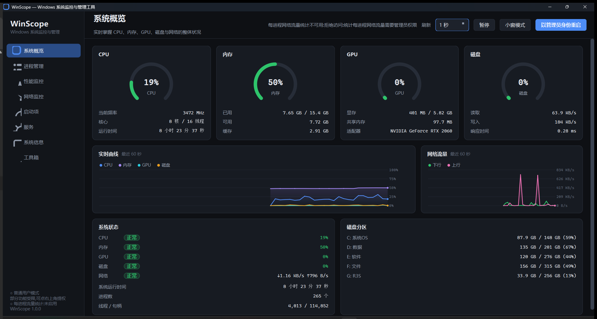
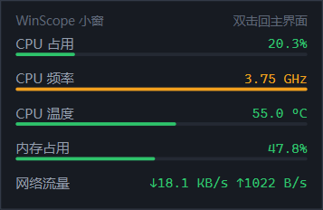
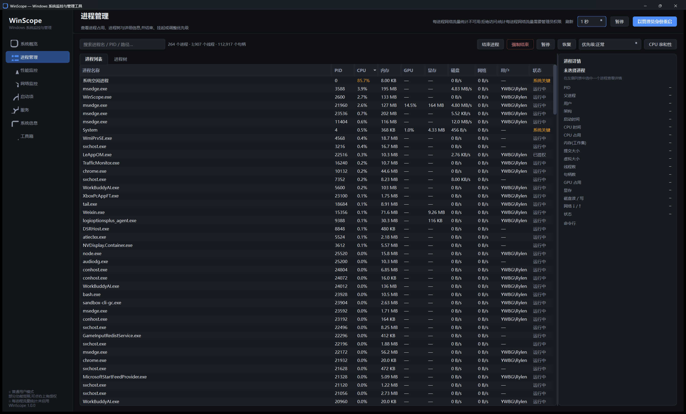
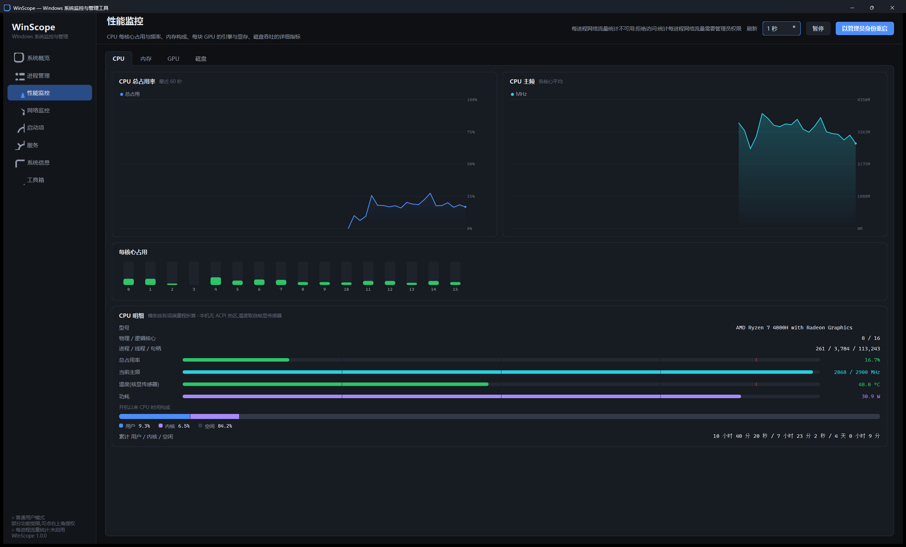
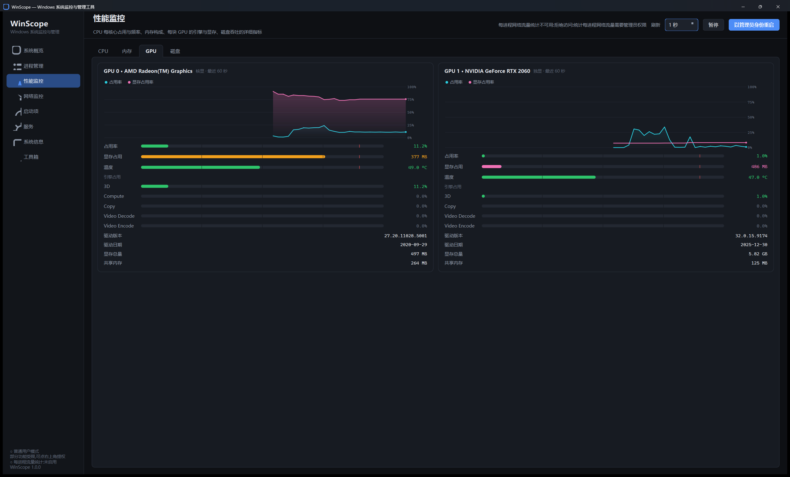
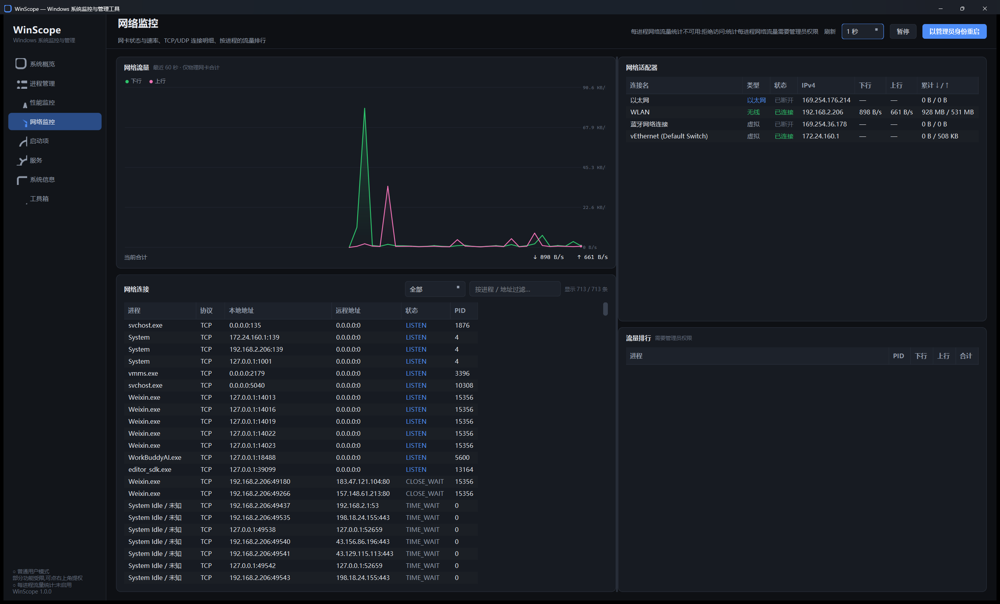

# WinScope

Windows 系统监控与管理工具。功能对齐任务管理器,但把进程、服务、启动项、网络连接、硬件信息
放在同一个界面里,并且尽量把「任务管理器不告诉你的事」补上 —— 每核心频率、每进程网络流量、
进程树、分区到物理盘的映射、注册表级的启动项开关。

Qt 6 + 纯 C++ 自绘界面,没有 QML、没有图片资源。



## 功能

| 页面 | 内容 |
| --- | --- |
| **系统概览** | CPU / 内存 / GPU / 磁盘 环形仪表 + 60 秒实时曲线、网络吞吐曲线、系统状态总览、分区容量 |
| **进程管理** | 进程列表(名称/PID/CPU/内存/GPU/显存/磁盘/网络/用户/状态)、多列排序、搜索、进程树、结束/强制结束/重启/暂停/恢复、优先级、CPU 亲和性、详情面板 |
| **性能监控** | CPU(总占用/主频/每核心/型号/功耗)、内存、**每块 GPU 单独一列**(占用/显存/各引擎)、磁盘(吞吐/IOPS/响应时间/分区)。明细统一是「横条 + 数值」,构成类指标(内存构成、CPU 时间构成)用堆叠条 + 图例 |
| **网络监控** | 网卡列表(IP/MAC/速率/累计流量)、TCP/UDP 连接表、按进程流量排行 |
| **启动项** | 注册表 Run + 启动文件夹 + 计划任务,启用/禁用/删除/定位文件/定位注册表 |
| **服务** | 服务列表、启停/重启/暂停/恢复、改启动类型 |
| **系统信息** | 操作系统、CPU、显卡、内存条、主板 BIOS、存储、网络完整明细,一键复制 |
| **工具箱** | 系统自带工具启动、网络诊断命令(带输出面板)、常用系统操作 |

### 桌面小窗

主界面右上角有个「小窗模式」:点一下主界面藏起来,只留一个无边框、置顶、可拖动的小窗,
显示你自己勾的那几项参数。适合把它丢在屏幕角落当常驻监视器。



- **只采集要用的数据**。采样范围按勾选的参数算出来,其余通道整拍跳过。
  实测只显示「CPU 占用 / 频率 / 温度 / 内存 / 网络」时,进程占用从完整模式的
  **7.6% 单核降到 0.47% 单核**;省下的大头是进程快照(要枚举全系统句柄)和连接表。
- 交互:左键拖动移动,双击回主界面,右键出菜单(选择参数 / 返回主界面 / 窗口置顶 / 退出)。
  无边框窗口没有标题栏,所以顶部写了一行「双击回主界面」。
- 可选的参数:CPU 占用 / 频率 / 温度 / 功耗、内存占用、GPU 占用 / 温度、网络流量、
  磁盘活动、运行时间。读不到的项留空,不编数。
- 勾选的参数、窗口位置、是否置顶都存进注册表(`HKCU\Software\WinScope\WinScope\miniWindow`),
  下次启动接着用;上次是停在小窗模式的话,这次直接进小窗。

#### 任务栏与托盘

小窗模式**不占任务栏按钮**:小窗的窗口类型是 `Qt::Tool`(Windows 上的
`WS_EX_TOOLWINDOW`),既不在任务栏留按钮,也不进 `Alt+Tab`。取而代之的是
**右下角通知区域的托盘图标**,和微信那类常驻程序一样:


(图里最左边那个蓝色方块就是 WinScope)

- 图标用的是和主窗口、任务栏完全同一个图形(`ws::icons::appIcon()`,
  一次生成 16/20/24/32/48/64/128/256 多档尺寸)。
- **左键单击**托盘图标 → 回主界面;**右键** → 菜单(显示主界面 / 选择小窗参数… / 退出)。
  悬停提示会显示前两个有读数的参数,不用展开小窗也能扫一眼。
- 退出小窗模式后托盘图标自动收起 —— 只在需要它的时候占位置。

有个平台坑值得记一笔:**Windows 11 默认会把新注册的托盘图标丢进「隐藏的图标」浮窗里**,
要用户手动拖出来一次才会常驻。这个开关是外壳管的
`HKCU\Control Panel\NotifyIconSettings\<id>\IsPromoted`,没有公开 API —— 系统设置里
「个性化 → 任务栏 → 其他系统托盘图标」改的就是它。项目要发给别人用,总不能要求
每个使用者都手动拖一次,所以程序会在第一次显示托盘图标时**自己把它设成可见**:

- 只改 `ExecutablePath` 和当前 exe 完全一致的那一条,别的程序一律不碰;
- **只做一次**(用 `HKCU\Software\WinScope\WinScope\tray\promoted` 记着),
  之后你在系统设置里怎么调都随你,程序不再覆盖。

想撤销的话,去「设置 → 个性化 → 任务栏 → 其他系统托盘图标」把 WinScope 关掉即可。

### 进程管理



### 性能监控

明细统一是「横条 + 数值」,构成类指标(内存构成、CPU 时间构成)用堆叠条 + 图例:



**核显 + 独显的机器上每块显卡各占一列**,各自的占用率曲线、显存曲线、引擎占用和
驱动信息分开算 —— PDH 的 GPU 计数器实例名里带 luid,靠它归属到具体适配器:



### 网络监控



## 构建

需要 Qt 6.5+、CMake 3.16+、支持 C++17 的编译器。开发环境用的是
Qt 6.11.2 (MinGW 13.1.0) + Ninja。

```bash
cmake -S . -B build -G Ninja \
      -DCMAKE_BUILD_TYPE=Release \
      -DCMAKE_PREFIX_PATH=/path/to/Qt/6.11.2/mingw_64
cmake --build build
```

只编采样层(无界面,方便在 CI 或没有显示器的环境里验证 Win32 读数):

```bash
cmake -S . -B build-selftest -G Ninja -DWINSCOPE_BUILD_GUI=OFF -DWINSCOPE_BUILD_SELFTEST=ON
cmake --build build-selftest
./build-selftest/sampler_selftest.exe
```

跑起来需要 Qt 的 DLL。`windeployqt` 在部分受限环境里会因为拉不起子进程而失败,
这种情况手动把 `Qt6Core/Gui/Widgets/Network.dll`、`platforms/qwindows.dll`
和 MinGW 的 `libgcc_s_seh-1 / libstdc++-6 / libwinpthread-1.dll` 拷到 exe 旁边即可。

## 权限

普通权限就能看全部监控数据。下面这些功能需要**以管理员身份运行**(右上角有提权按钮):

- 结束其它用户的进程、修改其它用户的进程
- 启停服务、修改服务启动类型
- 修改启动项(注册表的 StartupApproved 标记、计划任务)
- **按进程统计网络流量**(ETW,见下)

没提权时,界面上会明确标注哪一项不可用,不会静默显示空数据。

## 实现要点

### 采样层

全部系统调用跑在独立 `QThread` 里,结果通过排队信号投递回 UI 线程。
即使某次 WMI 查询卡 200ms,界面也不掉帧。

节奏(默认 1 秒一拍):每拍系统快照 + 进程快照,每 5 拍连接表,每 30 拍分区容量。

`SystemSampler::setScope()` 可以关掉其中几路(CPU / 内存 / GPU / 磁盘 / 网络 / 进程),
小窗模式就靠它把后台开销压下去。关掉的通道整拍不采样,但**不清空数据** —— 沿用上一帧的值,
这样从小窗切回主界面时不会先闪一片空白。刚被打开的通道会先"空跑"一拍只为重建基线:
CPU / 磁盘 / 网络的速率都是"两次采样的差值 ÷ 间隔",直接拿关掉期间攒了几十秒的差值来算,
第一帧会变成"过去 N 秒的平均值",看着像数据不对。

哪些指标需要哪几路采样,集中在 `src/core/Metrics.cpp` 一张表里(`MetricDef::channels`)。
这张表同时被小窗、参数选择对话框和采样范围计算三处消费,只有一份才不会漏同步;
自检工具里有一条回归专门验证"取值函数没有偷看它没声明的通道"。

### 用到的 Win32 接口

| 用途 | 接口 |
| --- | --- |
| 进程列表 / 每核心占用 / 线程句柄数 | `NtQuerySystemInformation`(5 / 8) |
| CPU 总占用、累计时间 | `GetSystemTimes` |
| CPU 实时主频、功耗 | `CallNtPowerInformation`、PDH `Energy Meter(*)\Power` |
| GPU 引擎占用、显存 | PDH `GPU Engine(*)` / `GPU Adapter Memory(*)`,DXGI 枚举适配器。实例名里的 `luid_0x<High>_0x<Low>` 与 `DXGI_ADAPTER_DESC1::AdapterLuid` 一一对应,靠它把每个实例归属到具体显卡,核显和独显才能各算各的 |
| 磁盘吞吐 / IOPS / 响应时间 | PDH `PhysicalDisk(*)`,分区→物理盘用 `IOCTL_VOLUME_GET_VOLUME_DISK_EXTENTS` |
| 网卡地址与速率 | `GetAdaptersAddresses` + `GetIfEntry2(Luid)` |
| TCP/UDP 连接 | `GetExtendedTcpTable` / `GetExtendedUdpTable`(`*OWNER_PID*`) |
| 每进程网络流量 | ETW `Microsoft-Windows-Kernel-Network` 实时会话 |
| 服务 | SCM(`EnumServicesStatusExW` + `QueryServiceConfig2W`) |
| 启动项 / 计划任务 | 注册表 + `ITaskService` COM + StartupApproved 二进制标记 |
| 硬件信息 | WMI(`Win32_VideoController` / `Win32_PhysicalMemory` / `Win32_BaseBoard` …) |
| CPU / GPU 温度 | ACPI 热区走 WMI `MSAcpi_ThermalZoneTemperature`;显卡温度走厂商 SDK 动态加载 —— AMD `atiadlxx.dll`(`ADL2_OverdriveN_Temperature_Get`,退回 PMLog `sensor[8]`)、NVIDIA `nvml.dll` / `nvapi64.dll` |

### 几个容易踩的坑

- **中文系统上 PDH 计数器名会被本地化**。一律用 `PdhAddEnglishCounterW`,失败再退回
  `PdhAddCounterW`。
- **PDH `Energy Meter(*)\Power` 的单位是毫瓦**,直接用会显示成上万瓦。
- **ADL 枚举的是"显示适配器",不是"显卡"**。一块 AMD 核显会被拆成 3 条,NVIDIA 的条目
  也会混在同一个列表里(调温度接口一律返回 `ADL_ERR_NOT_SUPPORTED`),所以
  `iAdapterIndex` 和 DXGI 的适配器序号毫无对应关系,只能按 `strAdapterName` 匹配型号名
  (实测和 DXGI 的 `Description` 完全一致)。按序号对应会把温度挂到错误的显卡上。
- **`nvapi_QueryInterface` 返回的是函数指针**,x64 上必须用 `void*` 接。写成 `int` 会把
  高 32 位截断,拿到的地址是垃圾,一调就崩。
- **`ADL2_Overdrive5_Temperature_Get` 在新驱动上已经废了**(返回
  `ADL_ERR_NOT_SUPPORTED`),得走 `ADL2_OverdriveN_Temperature_Get` 或
  `ADL2_New_QueryPMLogData_Get` 的 PMLog 传感器表。
- **DXGI 的适配器顺序不保证稳定**。同一台机器上不同进程枚举出来的顺序可能不同
  (实测核显/独显谁在前面会变),所以界面上的 "GPU 0/1" 只是序号,型号名才是身份。
- **PDH 的 GPU 实例名是 `pid_<pid>_luid_0x<High>_0x<Low>_phys_<n>_eng_<n>_engtype_<type>`**,
  两段 luid 分别是 `LUID.HighPart` / `LUID.LowPart`(实测确认)。老版本驱动没有 `phys_`
  段,所以解析要按标记找,不能按下标切。
- **`GetIfTable2` 会把同一块网卡按 NDIS 过滤驱动展开四五次**,改用
  `GetAdaptersAddresses`(每网卡一条)再按 Luid 补字节计数。
- **`WSAAddressToString` 前必须有 `WSAStartup`**,否则返回 `WSANOTINITIALISED(10093)`,
  表现是 IP / 网关 / DNS 全是空的,而且不报错。见 `src/core/WinsockInit.*`。
- **`winsock2.h` 必须排在 `windows.h` 之前**,而 `Win32Utils.h` 内部会拉 `windows.h`,
  所以用 winsock 的 .cpp 里这几个头要写在所有项目头之前。
- **非 ASCII 字面量别用 `QLatin1String`**。它按 Latin-1 解释字节,拿它和 `QString` 比
  永远不相等,表现是「明明显示着『正在运行』,统计出来却是 0」。中文一律 `QStringLiteral`。
- **`GetSystemTimes` 的 kernel 时间包含 idle**,直接拿来当"内核占用"会和空闲重复计算,
  「用户 + 内核 + 空闲」不等于 100%。要减掉 idle 再暴露给界面。
- **`CallNtPowerInformation(ProcessorInformation)` 在不少 AMD 机器上只返回标称频率**
  (实测 4800H 恒为 2900MHz,曲线一条直线)。实时主频改用 PDH
  `\Processor Information(_Total)\% Processor Performance` × 基准频率,拿不到才退回前者。
  另外 `Win32_Processor.MaxClockSpeed` 在这种机器上也会把基准频率当最大频率报,
  所以主频横条以标称上限为满量程,超过时用橙色表示"正在睿频"。
- **`AdapterRAM` 是 32 位字段会溢出**,显存要从 DXGI 取。
- **计划任务的 `ITriggerCollection::get_Item` 收 `LONG` 下标**,只有
  `IRegisteredTaskCollection` / `ITaskFolderCollection` 收 `VARIANT`。
- **调用 `ITaskService` 前当前线程必须初始化过 COM**,没初始化会创建失败而且不报错。
  见 `ws::ComInitializer`。
- **`GetVersionEx` 会撒谎**,Windows 版本走注册表 + `RtlGetVersion`;build ≥ 22000 时
  要把 `ProductName` 里的 "Windows 10" 改成 "Windows 11"。

### 界面

全自绘控件,没有 `.qrc`:

- `RingGauge` 270° 环形仪表
- `LineChart` 环形缓冲折线图,x 轴按容量固定步长,曲线从右往左生长
- `BarRow` 一行「名称 — 水平横条 — 数值」,横条带 25/50/75 刻度与警戒线
- `SegmentBar` 堆叠构成条 + 自动换行的图例,用于内存构成、CPU 时间构成
- `Card` 统一卡片容器,`StatRow` 一行键值,`Badge` 状态胶囊,`FlowLayout` 自动换行
- `MiniWindow` 桌面小窗:无边框 + 置顶 + 可拖动,整窗自绘(没有子控件),
  一行一个指标 + 一条细横条。窗口类型是 `Qt::Tool`,不占任务栏按钮
- `QSystemTrayIcon` 托盘图标:小窗模式下替代任务栏按钮,左键回主界面、右键出菜单
- `ws::icons::appIcon()` 是窗口图标 / 任务栏 / 托盘共用的那一份图形,
  `main.cpp` 里 `QApplication::setWindowIcon()` 一次定下来
- `app/Theme.cpp` 是唯一写颜色和全局 QSS 的地方,换主题只改这一个文件

## 目录

```
src/
  core/          采样层(与界面完全解耦,自检工具共用)
                 Metrics.cpp 是小窗可选指标的注册表:名称 / 需要的采样通道 / 取值函数
  app/           主题、图标、主窗口
  ui/widgets/    自绘控件(含 MiniWindow 桌面小窗)
  ui/pages/      8 个功能页
tools/
  selftest/      无界面自检,逐模块打印 Win32 读数
  uicheck/       界面自动截图核对(见 tools/uicheck/README.md)
  luidtest/      一次性探针:对照 PDH 的 GPU 实例名与 DXGI 适配器 LUID
  thermalprobe/  一次性探针:逐个试 PDH 热区 / WMI / NVAPI / ADL / NVML,打印返回码和原始值
```

## 已知限制

- **CPU 温度**三级回退:①ACPI 热区(WMI `MSAcpi_ThermalZoneTemperature`)→ ②核显传感器
  → ③**留空**。很多笔记本固件根本没实现 ACPI 热区,这时退到核显传感器 —— 核显和 CPU 核心
  在同一颗 die 上,读到的就是这颗芯片的温度,当参考值是合理的。但界面会如实标出来源
  (名称列显示「温度(核显传感器)」,卡片说明里也写明),不会让人以为读到了 CPU 自己的传感器。
  两条路都拿不到时**数值栏留空**(不写"不可用"字样,免得看着像个正常读数),原因写在卡片说明里。
- **核显能不能当 CPU 温度的代理,靠型号名白名单判定,宁可漏判不误判**。Windows 上没有可靠
  接口能查"这块 GPU 和 CPU 是否同一颗 die"(MinGW 里没有 `dxcore.h`,手写 DXCore 的 COM
  接口风险太高),只能看型号名。代价是不对称的:漏判只是温度留空,误判会把独显温度当成
  CPU 温度显示出去。所以规则是"正面白名单"(只认 `Radeon Graphics` 占位名、Vega 核显、
  `Radeon 680M/780M` 这类三位数字 + M 的型号),还要求读数确实出自 ADL。自检工具里有一组
  16 个真实型号名的回归样本。
- **独显温度**只显示在它自己的 GPU 列,**绝不参与 CPU 温度** —— 它是另一块 PCB、另一颗
  die,和 CPU 没有任何关系。
- **Intel 核显的温度暂时取不到**:ADL 只覆盖 AMD,NVML/NVAPI 只覆盖 NVIDIA。
  没有通用接口,加厂商 SDK 是唯一的路。
- **GPU 功耗 / 频率**仍然没有通用接口,统一不显示。
- **启动影响**列只有系统能给出评估时才显示,注册表项一律标「未标注」——
  Windows 不对 Run 键做影响评估。
- 按进程流量排行依赖 ETW,未提权时该卡片为空并提示需要管理员权限。
- **功耗 / IOPS / 响应时间 / 主频**的横条没有通用满量程(拿不到 TDP,也不知道盘是 HDD
  还是 SSD),按"标称上限"和"运行期观察到的峰值"里较大的那个折算,绝对值看右边的数字。
- **核显 / 独显**按专用显存是否小于 1GB 判定。判错了只是标签难看,不影响数据。
